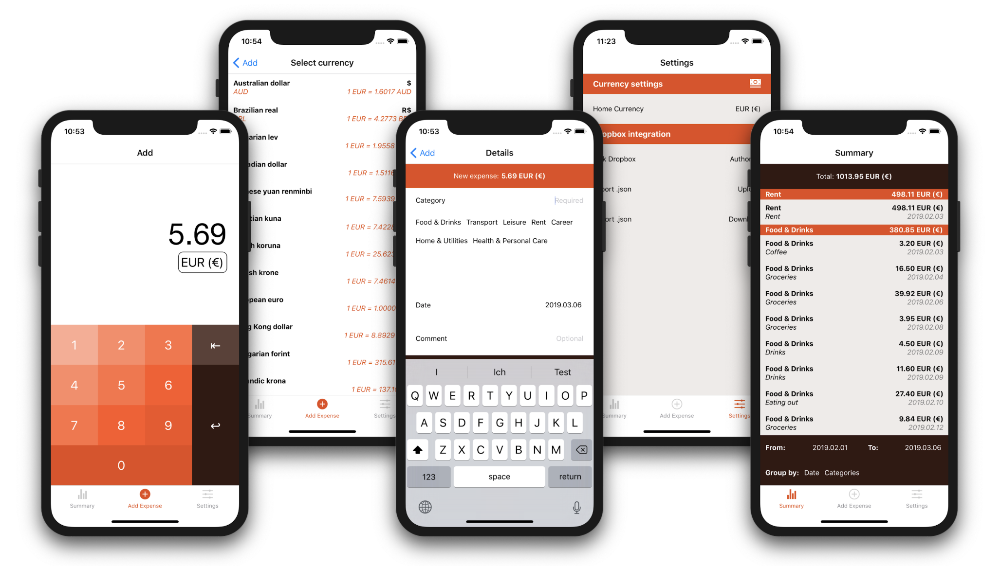

# Vault

*Multi-currency expense tracking that respects your privacy*

Vault is an offline-first, privacy-focused expense tracking app that allows you to track your expenses in multiple currencies with a few taps, without having to hand over your personal data in the process. Vault also allows you to import and export your expenses to Dropbox, providing a convenient backup mechanism.

I built this app as none of the options on the app store offered backup solutions using Dropbox and most of the apps required me to sign up for a new service that would then store my personal expense data.

## Screenshots



## Tech Stack
Vault is built from the ground up in React Native, using Expo SDK as a framework for rapid development. Redux is used for state and data management, using Async Storage as the main data storage solution. The Dropbox API provides a way to backup user data to the cloud without requiring the user to hand over data to Vault at any time.

## Contributing
If you want to run or develop Vault on your local machine, you'll need to:

**iOS**

1. Follow the [React Native Getting Started Guide](https://itunes.apple.com/app/xcode/id497799835) to get set up with Expo
2. Clone this repo with `git clone https://github.com/felixweinberger/vault`
3. Run `npm install` inside the `/client` folder
4. Start the app with `npm run ios`

**Debugging**

If you want to use React Native Debugger, you can run the following command in your terminal to enable live debugging (expo uses a different port to the standard React Native interface):

```
`REACT_DEBUGGER="unset ELECTRON_RUN_AS_NODE && open -g 'rndebugger://set-debugger-loc?port=19001' ||" npm start`
```

**Android**

TBD
